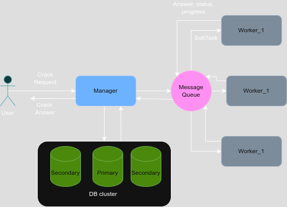

# Лабораторная работа №2: Распределённая система для подбора хэшей
### 📌 Цель работы
Разработка отказоустойчивой распределённой системы для перебора MD5-хэшей. Система должна гарантировать завершение обработки задачи даже при сбоях отдельных компонентов: менеджера, воркеров, очереди или базы данных.

### Технологический стек
**Golang** — язык разработки
**MongoDB** — база данных для хранения состояния задач (с репликацией)
**RabbitMQ** — брокер сообщений для связи между менеджером и воркерами
**Docker Compose** — для контейнеризации и управления сервисами

### 🛠️ Основные компоненты
#### Менеджер
- Принимает задачи от клиента
- Сохраняет задачу в MongoDB и отвечает клиенту только после успешной репликации
- Отправляет subtask'и воркерам через RabbitMQ
- При недоступности RabbitMQ — хранит задачи локально до восстановления
- Обрабатывает ответы от воркеров через отдельную очередь
- Поддерживает запросы прогресса выполнения

#### Воркеры
- Вычитывают задачи из очереди RabbitMQ
- Производят перебор в своём диапазоне
- Отправляют результат обратно через очередь
- Поддерживают параллельную работу
- Если воркер "падает", задача автоматически возвращается в очередь и переотправляется другому

#### MongoDB (репликация)
- Хранит данные о задачах
- Работает в реплика-сете: 1 primary + 2 secondary
- При падении primary автоматически происходит переключение

#### RabbitMQ
Используется несколько очередей:
- для задач от менеджера к воркерам
- для ответов c результататми (статусами и прогрессами) от воркеров к менеджеру
- Очереди — персистентные
- Все сообщения — с подтверждением (manual ack)

### 🛠️ Концептуальная архитектура

### Проверяемые кейсы

| Сценарий                                      | Поведение системы                                                        |
|----------------------------------------------|--------------------------------------------------------------------------|
|  Остановка менеджера                          | Принятые задачи сохранены, продолжается после рестарта                  |
| Ответ от воркера не дошёл до менеджера       | Ответ сохраняется в очереди, менеджер получит его позже                 |
| Остановка primary-ноды MongoDB               | Вторичная становится primary, работа продолжается                       |
| Остановка RabbitMQ                           | Сообщения сохраняются, продолжается работа после рестарта              |
| Остановка воркера во время работы            | Задача возвращается в очередь, обрабатывается другим                    |

### 📌 TODO
- [ ]  Метрики и мониторинг
- [ ]  UI-клиент для отслеживания прогресса
- [ ]  Авторизация/аутентификация клиентов

